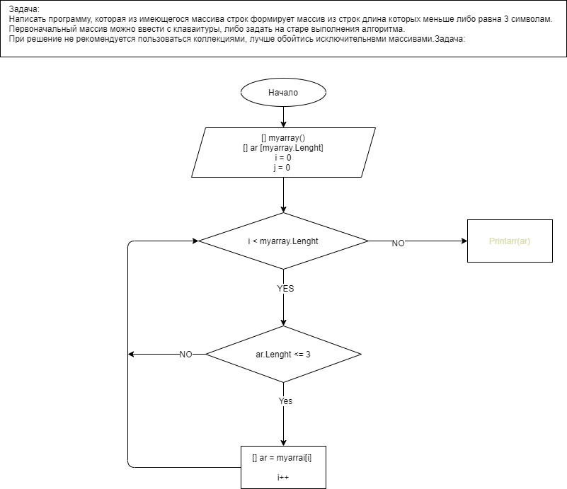

# Задача: 
Написать программу, которая из имеющегося массива строк формирует массив из строк длина которых меньше либо равна 3 символам.  
Первоначальный массив можно ввести с клаваитуры, либо задать на старе выполнения алгоритма. 
При решение не рекомендуется пользоваться коллекциями, лучше обойтись исключительнвми массивами.Задача: 

# Блок-схема к решению 
блок схема представлена в файле **List.drawio** или 

# Решение:
*Объявляем массив с названием* **myarray**

String[] myarray = { "world", "yes", "no", "Hello", "125", "25", "4567", "123" };

*Cоздаем метод **arr** заданного массива на экран*

void arr(string[] arrString) 

{
    for (int i = 0; i < arrString.Length; i++)

    {
        Console.Write(arrString[i] + " ");
    }
}

*Bыводим объявленный массив с помощью созданного метода*

arr(myarray);

Console.WriteLine();

*Создаем новый массив, в который будем собирать каждый элемент*

var ar = new string [myarray.Length];

var arSize = 0;

*С помощь цикла foreach перебираем каждые элемент массива - **myarray**.* Проверяем выполнение условия элемент массива - **myarray** имею
foreach (var value in myarray)

 *Проверяем выполнение условия каждого элемента массива - **myarray** имеющего количество символов меньше либо равна 3*
{
    if (value.Length <= 3)

    {
        ar[arSize] = value;
        arSize++;
    }
}

*Выводим на эркран с помощью ранее созданного метода, массив с элементами у которых количество символов меньше либо равна 3*
arr(ar);

# Результат:
yes no 125 25 123
